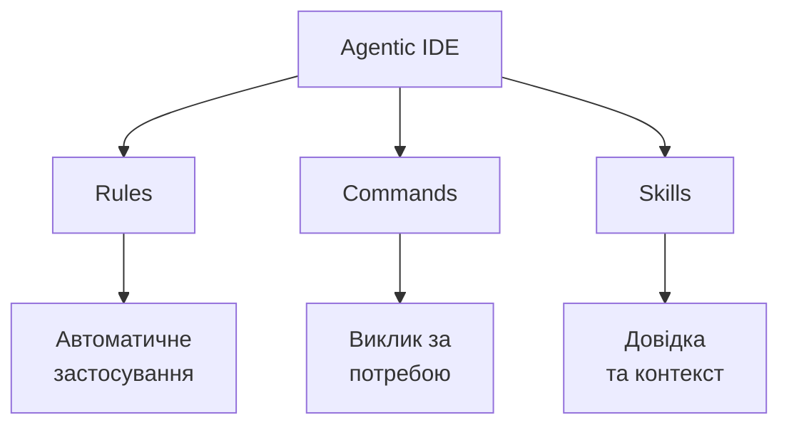
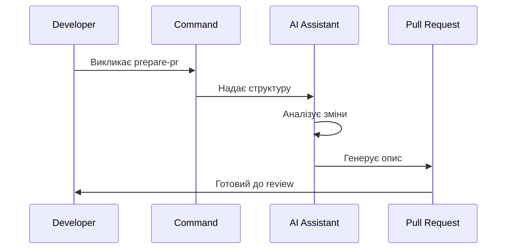
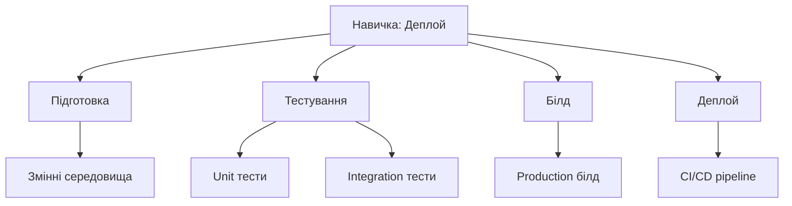

# Правила, команди та навички для Agentic IDE

Практичний воркшоп

<div class="pt-12">
  <span @click="$slidev.nav.next" class="px-2 py-1 rounded cursor-pointer" hover="bg-white bg-opacity-10">
    Почнемо <carbon:arrow-right class="inline"/>
  </span>
</div>

<!--
Вступна презентація про три основні інструменти для роботи з Agentic IDE
-->

---
transition: fade-out
---

# План воркшопу

<div class="grid grid-cols-2 gap-4">

<div>

## Що розглянемо

- Тріада: Правила, Команди, Навички
- Чому це важливо
- Коли що використовувати
- Практичні приклади
- Типові помилки

</div>

<div>

## Що отримаєте

- Чітке розуміння різниці
- Практичні патерни
- Інструменти для роботи
- Вправи для закріплення

</div>

</div>

<!--
Структура воркшопу та очікувані результати
-->

---
layout: two-cols
layoutClass: gap-8
---

# Тріада: Правила, Команди, Навички

<div v-click>

## Правила (Rules)
**Що це:** Постійні інструкції для AI
- Зберігаються в `.cursor/rules/`
- Застосовуються автоматично
- Визначають стиль, стандарти, обмеження

</div>

<div v-click>

## Команди (Commands)
**Що це:** Переповторювані дії
- Зберігаються в `.cursor/commands/`
- Викликаються за потреби
- Інкапсулюють складні workflow

</div>

<div v-click>

## Навички (Skills)
**Що це:** Документація знань
- Зберігаються в `.cursor/skills/`
- Описують як щось робити
- Довідкова інформація для AI

</div>

::right::

<div class="mt-8">



</div>

<!--
Визначення трьох основних концепцій та їх взаємозв'язок
-->

---
transition: slide-up
---

# Чому це важливо?

<div class="grid grid-cols-3 gap-6 mt-8">

<div v-click>

## Ефективність
- **Правила** економлять час на повторенні інструкцій
- **Команди** автоматизують складні дії
- **Навички** надають контекст швидко

</div>

<div v-click>

## Консистентність
- **Правила** забезпечують однаковий стиль
- **Команди** стандартизують процеси
- **Навички** підтримують best practices

</div>

<div v-click>

## Масштабованість
- **Правила** працюють на всіх файлах
- **Команди** переповторювані між проектами
- **Навички** накопичують знання

</div>

</div>

<!--
Обґрунтування важливості розуміння різниці між трьома концепціями
-->

---
layout: default
---

# Коли що використовувати?

<div class="grid grid-cols-2 gap-6 mt-6">

<div>

## Правила
✅ Стиль коду  
✅ Стандарти проекту  
✅ Обмеження та заборони  
✅ Автоматичні перевірки  

**Приклад:** "Використовуй TypeScript, завжди додавай типи"

</div>

<div>

## Команди
✅ Складні workflow  
✅ Повторювані завдання  
✅ Багатокрокові процеси  
✅ Автоматизація рутини  

**Приклад:** "Створи PR з описом змін та тест-планом"

</div>

</div>

<div class="mt-6">

## Навички
✅ Документація процесів  
✅ Best practices  
✅ Як щось зробити  
✅ Довідкова інформація  

**Приклад:** "Як експортувати Slidev до PDF"

</div>

<!--
Практичне керівництво по вибору правильного інструменту
-->

---
transition: fade-out
---

# Приклад 1: Створення компонента

<div v-click>

## Сценарій
Потрібно створити новий Vue компонент з певними вимогами

</div>

<div v-click class="mt-4">

## Як би ви це зробили?

**❌ Без структури:**
- Кожен раз описуєте всі вимоги
- Ризик неконсистентності
- Втрата часу на повторення

</div>

<div v-click class="mt-4">

## ✅ З правилами та командами:

**Правило:** `.cursor/rules/vue-components.mdc`
```
- Використовуй script setup
- Додавай TypeScript типи
- Дотримуйся naming conventions
```

**Команда:** `.cursor/commands/create-component.mdc`
```
Створи Vue компонент [name] з:
- TypeScript
- Props з типами
- Emits з типами
```

</div>

<!--
Практичний приклад використання правил та команд для створення компонентів
-->

---
layout: two-cols
---

# Приклад 2: Code Review Workflow

<div v-click>

## Проблема
Потрібно підготувати PR з правильним описом та тестами

</div>

<div v-click class="mt-4">

## Рішення з командою

**`.cursor/commands/prepare-pr.mdc`**

```markdown
# Prompt
Підготуй PR опис:
- Короткий summary змін
- Тест-план
- Checklist для reviewer
```

</div>

<div v-click class="mt-4">

## Результат
- Консистентні PR описи
- Економія часу
- Менше питань від reviewer

</div>

::right::

<div class="mt-8">



</div>

<!--
Приклад автоматизації workflow через команди
-->

---
---

# Приклад 3: Документація навичок

<div class="grid grid-cols-2 gap-6 mt-6">

<div v-click>

## Навичка: Експорт до PDF

**`.cursor/skills/export-pdf.mdc`**

```markdown
# Як експортувати Slidev до PDF

1. Встанови playwright-chromium
2. Запусти: npm run export -- --format pdf
3. PDF з'явиться в slidev/
```

</div>

<div v-click>

## Переваги

✅ AI знає як експортувати  
✅ Не потрібно шукати в документації  
✅ Консистентні результати  
✅ Накопичення знань проекту  

</div>

</div>

<div v-click class="mt-6">

## Коли використовувати навички?

- Складні процеси з багатьма кроками
- Специфічні для проекту знання
- Best practices та patterns
- Інтеграції з інструментами

</div>

<!--
Демонстрація використання навичок для документації знань
-->

---
transition: slide-up
---

# Типові помилки

<div class="grid grid-cols-2 gap-6 mt-6">

<div v-click>

## ❌ Помилка 1: Все в правилах
**Проблема:** Правила стають занадто довгими та складними

**Рішення:** Використовуй команди для складних workflow

</div>

<div v-click>

## ❌ Помилка 2: Дублювання
**Проблема:** Однакові інструкції в правилах та командах

**Рішення:** Правила = загальні принципи, Команди = конкретні дії

</div>

<div v-click>

## ❌ Помилка 3: Відсутність навичок
**Проблема:** AI не знає як виконати складні завдання

**Рішення:** Документуй процеси як навички

</div>

<div v-click>

## ❌ Помилка 4: Занадто багато правил
**Проблема:** Правила конфліктують або ігноруються

**Рішення:** Пріоритизуй, групуй, видаляй застарілі

</div>

</div>

<!--
Типові помилки та як їх уникнути
-->

---
layout: center
class: text-center
---

# Вправа 1: Вибір інструменту

<div class="mt-8 text-left max-w-2xl mx-auto">

**Сценарій:** Потрібно додати нову функцію в проект

**Завдання:** Визначте, що краще використати для кожного кроку:

1. Переконатися, що код відповідає стилю проекту
2. Створити функцію з тестами та документацією
3. Додати функцію до API документації
4. Підготувати commit message з описом змін

<div v-click class="mt-6 p-4 bg-blue-500 bg-opacity-10 rounded">

**Відповіді:**
- Крок 1: **Правило** (автоматична перевірка стилю)
- Крок 2: **Команда** (складний workflow)
- Крок 3: **Навичка** (як оновити документацію)
- Крок 4: **Команда** (структурований commit message)

</div>

</div>

<!--
Практична вправа на вибір правильного інструменту
-->

---
layout: default
---

# Вправа 2: Створення команди

<div class="mt-6">

**Завдання:** Створіть команду для автоматичного рефакторингу

<div v-click class="mt-4">

## Що має робити команда?

- Аналізувати поточний код
- Визначати можливості для покращення
- Застосовувати рефакторинг
- Додавати коментарі про зміни

</div>

<div v-click class="mt-4">

## Структура команди:

```markdown
---
description: Рефакторинг коду з аналізом
command: refactor-code
---

# Prompt
Проаналізуй код та запропонуй рефакторинг:
- Покращення читабельності
- Видалення дублювання
- Оптимізація продуктивності
```

</div>

</div>

<!--
Практична вправа на створення команди
-->

---
layout: two-cols
---

# Вправа 3: Документація навички

<div v-click>

**Завдання:** Створіть навичку для деплою проекту

</div>

<div v-click class="mt-4">

## Що має містити навичка?

- Кроки деплою
- Необхідні змінні середовища
- Команди для запуску
- Troubleshooting

</div>

<div v-click class="mt-4">

## Приклад структури:

```markdown
---
description: Деплой проекту на production
---

# Деплой проекту

1. Перевір змінні середовища
2. Запусти тести
3. Білд проекту
4. Деплой через CI/CD
```

</div>

::right::

<div class="mt-8">



</div>

<!--
Практична вправа на створення навички
-->

---
transition: fade-out
---

# Ключові висновки

<div class="grid grid-cols-2 gap-6 mt-8">

<div>

## Правила
- Для постійних інструкцій
- Автоматичне застосування
- Стиль та стандарти

</div>

<div>

## Команди
- Для складних workflow
- Виклик за потреби
- Автоматизація процесів

</div>

</div>

<div class="mt-6">

## Навички
- Для документації знань
- Довідкова інформація
- Best practices та patterns

</div>

<div v-click class="mt-8 p-4 bg-green-500 bg-opacity-10 rounded">

**Головне правило:** Використовуй правильний інструмент для правильного завдання

</div>

<!--
Підсумок ключових концепцій та рекомендацій
-->

---
layout: center
class: text-center
---

# Дякуємо за увагу!

<div class="mt-8">

## Питання?

</div>

<div class="mt-12 text-sm opacity-75">

Правила, команди та навички для Agentic IDE

</div>

<!--
Фінальний слайд з можливістю для питань
-->
